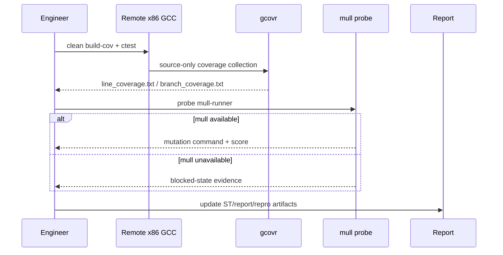
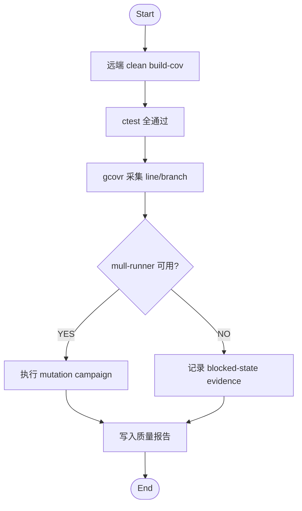

# Plan: NFR-005 覆盖率口径固化 (Feature #14)

**Date**: 2026-03-12
**Feature**: #14 — NFR-005 覆盖率口径固化
**Priority**: high
**Dependencies**: #9
**Design Reference**: docs/plans/2026-03-12-pipnn-poc-design.md § 4.3

## Context
This feature turns the wave-2 coverage methodology into a repo-local harness instead of oral process. The end state is a documented remote x86 GCC coverage command plus a mechanical validator that proves the fetched evidence satisfies the configured thresholds.

## Design Alignment
### 4.3 特性C：质量证据工作流

#### 时序图

#### 流程图

- **Key classes**: none; this feature is harness-oriented and should prefer scripts plus mechanical validation over new product abstractions.
- **Interaction flow**: `remote_coverage.sh` syncs the repo, invokes `remote_coverage_inner.sh` on the x86 host, fetches `results/st/*`, then `validate_quality_evidence.py` checks the fetched totals against `feature-list.json` quality gates.
- **Third-party deps**: existing `generic-x86-remote` scripts, remote GCC toolchain, Python 3 `gcovr`.
- **Deviations**: none.

## SRS Requirement
- NFR-005 覆盖率度量（Must）
  - 需求: 对外审计使用的覆盖率结果应以远端 x86 GCC 的 clean `build-cov` 结果为准；统计范围仅包含项目自有源文件，排除第三方 `_deps`、编译器识别目录以及编译器生成的 throw/unreachable branch。
  - 验证: 在远端 x86 主机执行文档化 coverage 命令，生成 `results/st/line_coverage.txt` 与 `results/st/branch_coverage.txt`，并满足 `line >= 90%`、`branch >= 80%`。

## Tasks

### Task 1: Write failing harness tests
**Files**: `tests/test_quality_evidence.cpp` (create), `tests/CMakeLists.txt` (modify)
**Steps**:
1. Add a new test binary that invokes a validator script on:
   - a passing fixture pair
   - a failing branch-threshold fixture pair
   - the real fetched coverage reports under `results/st/`
2. Assert the new test fails before the validator exists.
3. Build and run only the new test.
4. **Expected**: the new test fails for missing validator / missing checks, not for unrelated compile errors.

### Task 2: Implement the validator
**Files**: `scripts/validate_quality_evidence.py` (create)
**Steps**:
1. Parse gcovr text reports and extract TOTAL line percentages.
2. Read thresholds from `feature-list.json`.
3. Validate:
   - line report exists and parses
   - branch report exists and parses
   - totals meet configured thresholds
4. Emit concise stdout with measured line/branch percentages and exit non-zero on violations.
5. Re-run the new test binary.
6. **Expected**: all new tests pass.

### Task 3: Bind the harness entrypoint
**Files**: `examples/feature-14-coverage-gate.sh` (create), `RELEASE_NOTES.md` (modify later in persist)
**Steps**:
1. Add an example script that runs `bash scripts/quality/remote_coverage.sh` then `python3 scripts/validate_quality_evidence.py`.
2. Keep the example self-contained and repo-relative.
3. Run the example or the two commands manually.
4. **Expected**: fetched reports validate successfully.

### Task 4: Quality evidence refresh
**Files**: `results/st/line_coverage.txt`, `results/st/branch_coverage.txt` (refresh if changed)
**Steps**:
1. Run `bash scripts/quality/remote_coverage.sh`.
2. Run `python3 scripts/validate_quality_evidence.py`.
3. Record the measured totals for this feature cycle.
4. **Expected**: line >= 90 and branch >= 80 on remote x86 GCC.

### Task 5: Refactor / tidy
**Files**: modified files only
**Steps**:
1. Remove duplication in the validator or test helpers if needed.
2. Re-run targeted test and full `ctest`.
3. **Expected**: no regressions.

### Task 6: Mutation gate awareness
**Files**: none unless harness changes are needed
**Steps**:
1. Run `bash scripts/quality/remote_mutation_probe.sh`.
2. Record that feature 14 depends only on coverage and that mutation blocked-state belongs to feature 15.
3. **Expected**: blocked-state evidence remains available for the next cycle.

## Verification
- [ ] `tests/test_quality_evidence.cpp` passes
- [ ] `ctest --test-dir build --output-on-failure` passes
- [ ] `bash scripts/quality/remote_coverage.sh` completes
- [ ] `python3 scripts/validate_quality_evidence.py` reports line >= 90 and branch >= 80
- [ ] Example script is runnable
