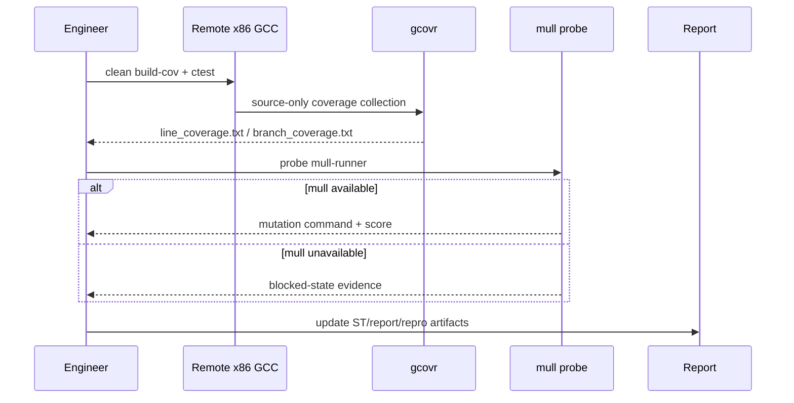
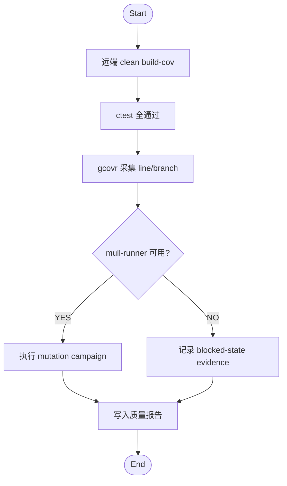

# Plan: NFR-006 mutation 证据与阻塞态审计 (Feature #15)

**Date**: 2026-03-12
**Feature**: #15 — NFR-006 mutation 证据与阻塞态审计
**Priority**: high
**Dependencies**: #9
**Design Reference**: docs/plans/2026-03-12-pipnn-poc-design.md § 4.3

## Context
Feature 15 turns the mutation probe from an ad hoc command into an auditable repo workflow. The end state is: local/remote probe logs are validated mechanically, the ST report references the blocked-state evidence and follow-up action, and the reproducibility manifest records the mutation evidence bundle.

## Design Alignment
### 4.3 特性C：质量证据工作流

#### 时序图

#### 流程图

- **Key classes**: none; prefer validators, report updates, and manifest fields.
- **Interaction flow**: `remote_mutation_probe.sh` refreshes local/remote probe logs, `validate_mutation_evidence.py` validates the logs plus docs, and the ST/report artifacts become the audit surface.
- **Third-party deps**: existing `generic-x86-remote` scripts, Python 3.
- **Deviations**: none.

## SRS Requirement
- NFR-006 Mutation 证据（Must）
  - 需求: 系统应先对本地与远端 x86 环境执行 `mull-runner` 可用性探测；若工具可用，则执行 mutation campaign 并满足 `mutation_score >= 80%`；若工具不可用，则必须记录 blocked-state evidence，并在测试报告中给出处置结论与后续动作。
  - 验证: 运行文档化 mutation probe/command，检查日志、报告、以及 `Go/Conditional-Go/No-Go` 结论。

## Tasks

### Task 1: Write failing tests
**Files**: `tests/test_mutation_evidence.cpp` (create), `tests/CMakeLists.txt` (modify)
**Steps**:
1. Add a new test binary that invokes a mutation-evidence validator on:
   - a blocked fixture pair with compliant docs/manifest
   - a blocked fixture pair with missing blocked-state note
   - the real local/remote probe logs plus current ST report and repro manifest
2. Build and run the new test.
3. **Expected**: it fails because the validator and/or required document fields do not exist yet.

### Task 2: Implement the validator
**Files**: `scripts/validate_mutation_evidence.py` (create)
**Steps**:
1. Parse local and remote probe logs for `status=available|blocked`.
2. When blocked:
   - require both docs to reference the probe evidence paths
   - require a follow-up action and release disposition note
3. When available:
   - require docs to reference mutation score evidence
4. Re-run the new test.
5. **Expected**: fixture-based checks pass.

### Task 3: Update the audit docs
**Files**: `docs/plans/2026-03-12-st-report.md`, `results/repro_manifest.json`
**Steps**:
1. Amend the ST report so mutation quality is described using the current blocked-state evidence and next action.
2. Add mutation evidence metadata to the reproducibility manifest.
3. Re-run the validator on the real artifacts.
4. **Expected**: real-artifact validation passes.

### Task 4: Add runnable example
**Files**: `examples/feature-15-mutation-evidence.sh` (create)
**Steps**:
1. Run the probe wrapper.
2. Run the validator.
3. **Expected**: blocked-state evidence is accepted as the current audited result.

### Task 5: Verification
**Steps**:
1. Run `ctest --test-dir build --output-on-failure`
2. Run `bash scripts/quality/remote_mutation_probe.sh`
3. Run `python3 scripts/validate_mutation_evidence.py`
4. **Expected**: tests pass and the real artifact validation passes.
