# PiPNN PoC 架构设计文档（Design）

- Date: 2026-03-12
- Status: Approved
- SRS Reference: docs/plans/2026-03-12-pipnn-poc-srs.md

## 0. UCD 阶段说明

No UI features detected in SRS — skipping UCD phase.

## 1. 设计驱动输入

- 功能驱动: FR-001..FR-010
- NFR驱动: 三档口径（100k/100, 200k/100, 500k/100）、wave 4 口径（100k/200, 1M/100）、Recall@10 >= 0.95、远端 x86 GCC 权威 coverage、远端 x86 Clang/Mull scored mutation evidence
- 约束: C++ + CMake；HNSW 必须用标准 hnswlib；远端 x86 主机评测
- 关键已知瓶颈: leaf-kNN 阶段在构图时间中占主导

## 2. 方案对比与推荐

### 2.1 Approach A: 朴素高扇出（fanout=2/3）
- How: 通过高 fanout 增加重叠叶子，单次分区完成较高图质量。
- Pros: 实现直观，召回易上升。
- Cons: 候选边爆炸，leaf-kNN 成本高，构图慢。
- NFR impact: 质量可达标，性能风险高。

### 2.2 Approach B: 低扇出 + 多副本（推荐）
- How: fanout=1 降低单次分区复杂度，通过 replicas 合并候选恢复召回。
- Pros: 构图速度更优，召回可通过 beam 与 replicas 调整。
- Cons: 参数空间更大，需要 profile 驱动调参。
- NFR impact: 更有机会同时满足性能与质量阈值。

### 2.3 Approach C: 激进剪枝近似候选
- How: 在 leaf 内做强采样或候选截断（scan cap）。
- Pros: 理论上更快。
- Cons: 当前实测收益有限，可能导致召回骤降。
- NFR impact: 性能可提升但质量风险最高。

### 推荐
采用 **Approach B**。该方案在实测中表现为：构图速度显著优于 HNSW，且召回可保持在高位（通过 beam 调整）。

## 3. 逻辑架构

### 3.1 Logical View

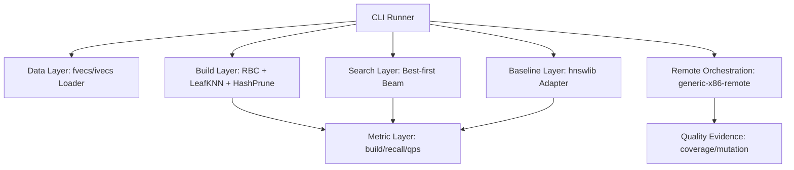

### 3.2 Component View

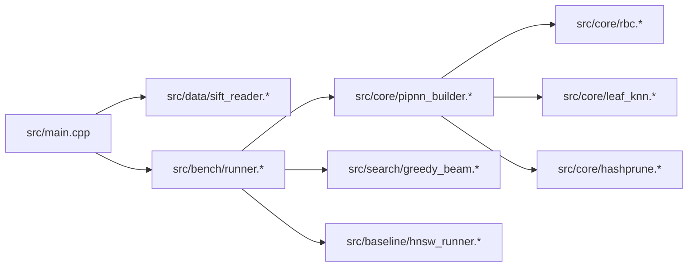

## 4. 关键特性设计

### 4.1 特性A：PiPNN 构图

#### 类图

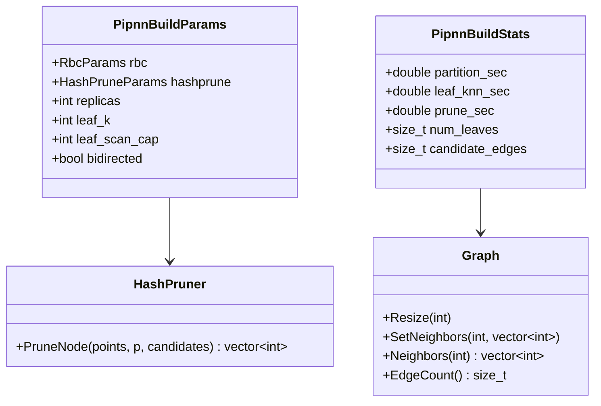

#### 时序图

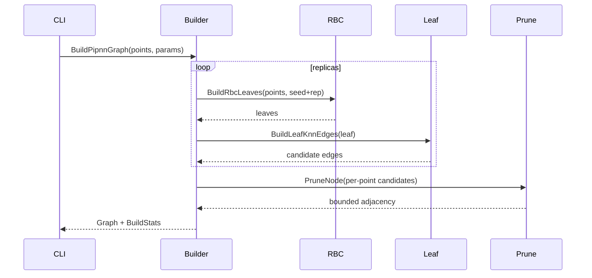

#### 流程图

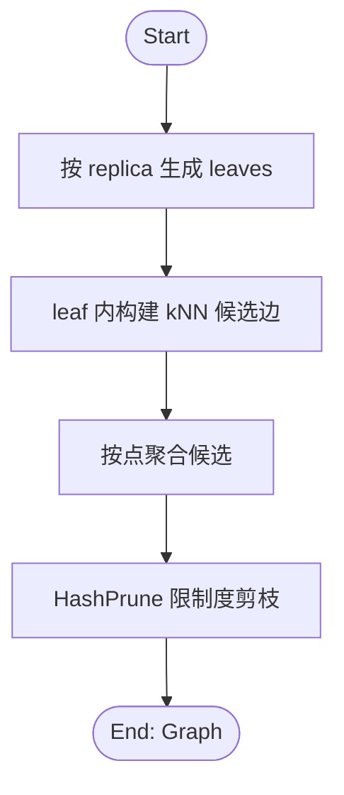

### 4.2 特性B：统一评测与基线对比

#### 时序图

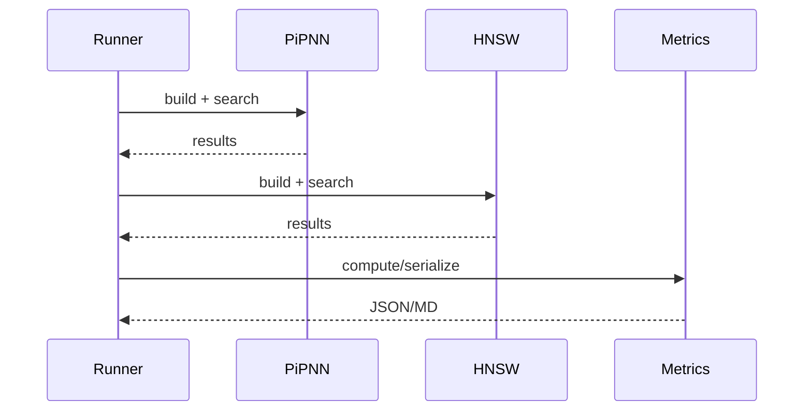

### 4.3 特性C：质量证据工作流

#### 时序图

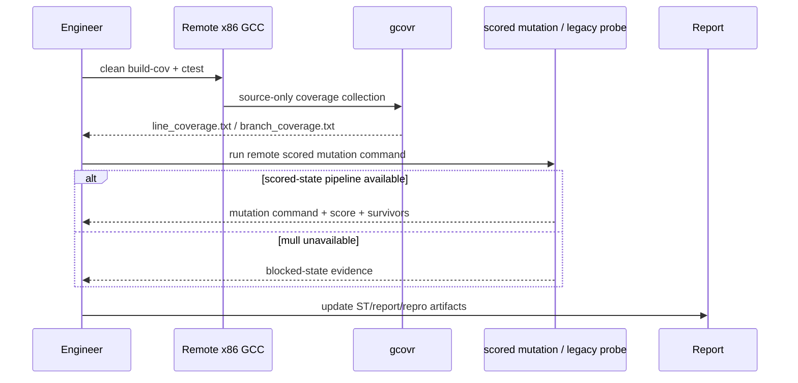

#### 流程图

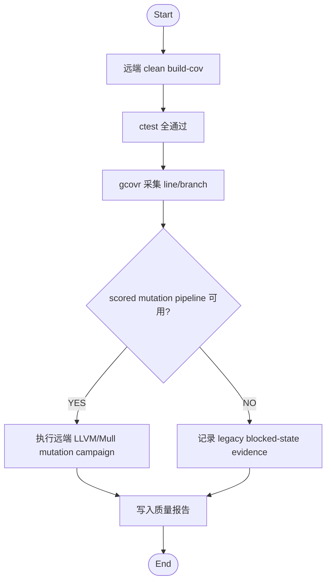

### 4.4 特性D：远端 scored mutation pipeline

#### 时序图

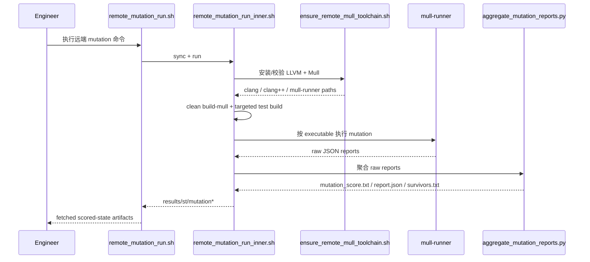

#### 流程图

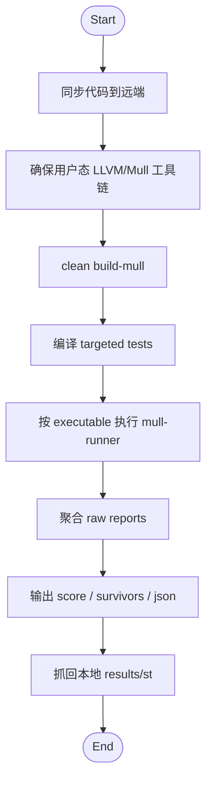

### 4.5 特性E：HashPrune Fidelity

#### 流程图

```mermaid
flowchart TD
  A([Start]) --> B[定义 paper-oriented prune 语义]
  B --> C[实现 bucket / replacement / tie-break 诊断]
  C --> D[跑 100k/200 快速迭代]
  D --> E{Recall@10 >= 0.95?}
  E -- NO --> B
  E -- YES --> F([End])
```

#### 设计要点

- 该阶段只处理 `HashPrune` 语义，不混入 `RBC` 或 `leaf_kNN` 优化。
- 需要输出 kept/dropped candidate 统计，避免仅靠 recall 反推语义是否贴近 paper。
- 顺序无关性和 bounded-memory 行为要通过机械化测试固定下来。

### 4.6 特性F：RBC Fidelity

#### 流程图

```mermaid
flowchart TD
  A([Start]) --> B[调整 leader / overlap 策略]
  B --> C[输出 leaf_count / overlap 统计]
  C --> D[跑 100k/200 快速迭代]
  D --> E{Recall@10 >= 0.95?}
  E -- NO --> B
  E -- YES --> F([End])
```

#### 设计要点

- 在 `HashPrune` 语义固定后再调 `RBC`，避免把候选质量问题与剪枝语义问题混淆。
- 该阶段必须把 overlap 诊断纳入 benchmark artifact，而不是依赖一次性 shell 观察。

### 4.7 特性G：leaf_kNN Optimization

#### 时序图

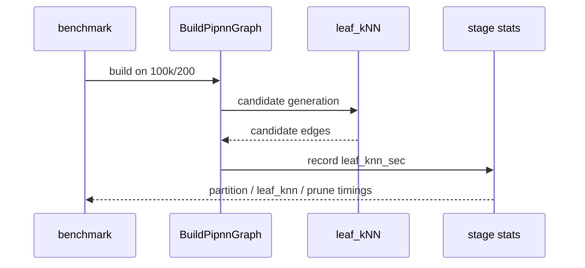

#### 设计要点

- 该阶段默认继承特性E/F 的语义，不重新打开 fidelity 决策。
- 主要目标是压低 `leaf_knn_sec`，并保持阶段结束时 `Recall@10 >= 0.95`。

### 4.8 特性H：1M Authority Benchmark

#### 流程图

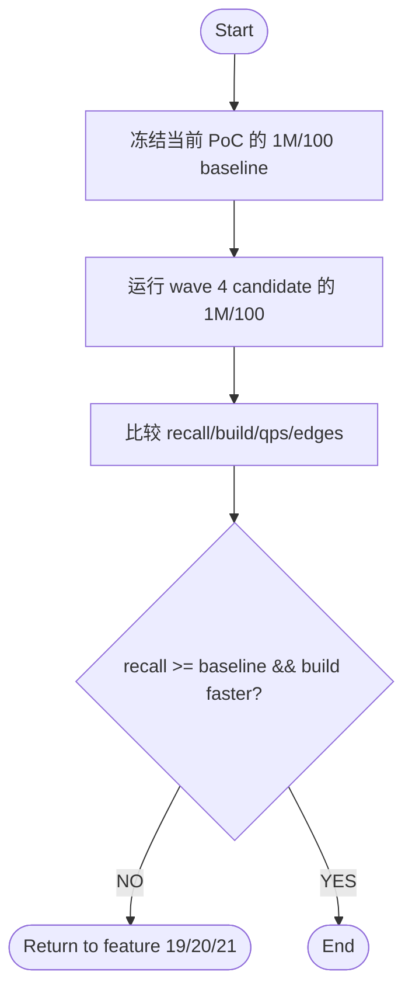

#### 设计要点

- `1M/100` baseline 必须先冻结一次，后续 authority 比较都以它为准。
- 该阶段是 wave 4 的唯一 authority gate，不在中间阶段反复跑全量。

## 5. 数据模型

PoC 采用内存结构，不引入持久化 DB。

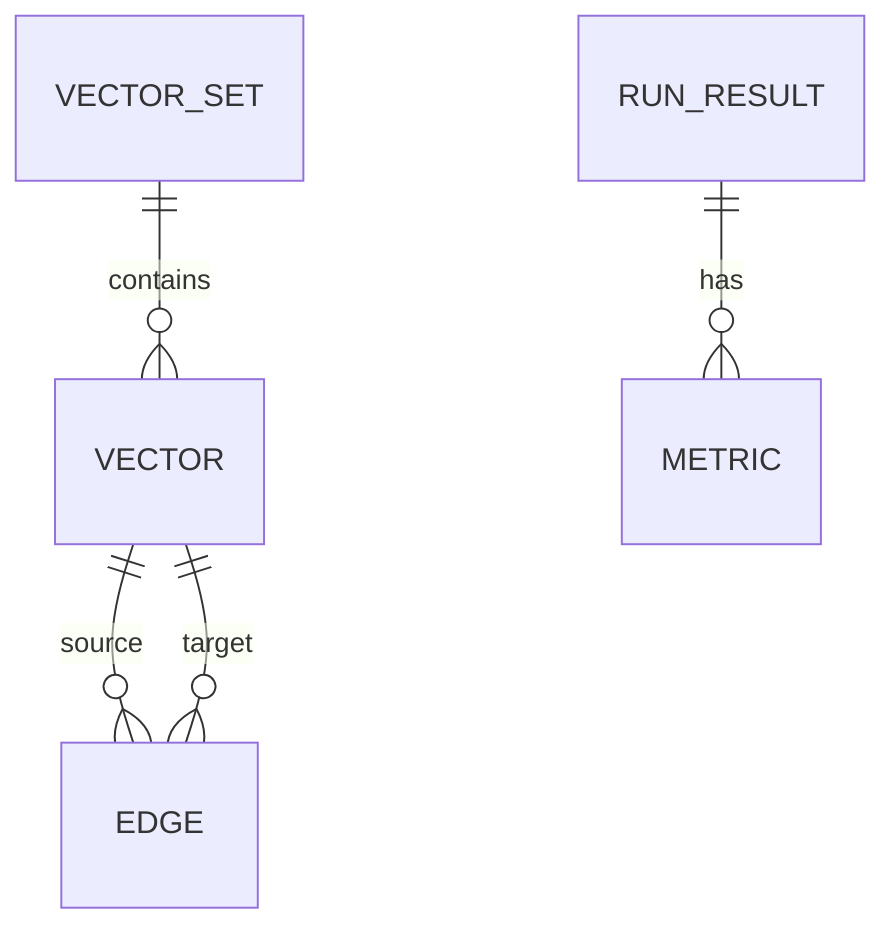

## 6. API/接口设计

- CLI
  - `--mode <pipnn|hnsw>`
  - `--dataset <synthetic|sift1m>`
  - `--base/--query/--truth`
  - `--max-base/--max-query`
  - `--rbc-cmax/--rbc-fanout/--leader-frac/--max-leaders/--replicas`
  - `--leaf-k/--leaf-scan-cap/--max-degree/--hash-bits/--beam/--bidirected`

- 远端接口
  - generic-x86-remote: `check-env.sh/sync.sh/run.sh/run-bg.sh/fetch.sh`

## 7. 依赖与版本

| Dependency | Version/Source | License | 用途 |
|---|---|---|---|
| CMake | >= 3.20 | BSD-3-Clause | 构建系统 |
| C++ compiler | GCC 13+/Clang 17+ | N/A | 编译 |
| OpenMP | 系统提供 | N/A | 并行加速 |
| hnswlib | GitHub `nmslib/hnswlib` (master, fetched at build time) | Apache-2.0 | 基线索引 |
| Python3 | >= 3.10 | PSF | 远端脚本/汇总 |

### Dependency Graph

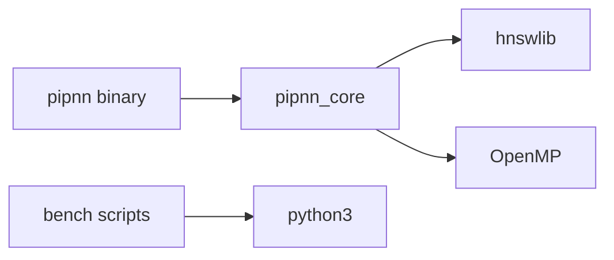

## 8. 测试策略

- 单元测试: `hashprune/sift_reader/rbc/leaf_knn`
- 集成测试: `pipnn_integration`
- 评测回归: 100k/100, 200k/100, 500k/100（固定矩阵） + 100k/200（wave 4 快速迭代） + 1M/100（wave 4 authority）
- 关键验证:
  - `ctest --test-dir build --output-on-failure`
  - 远端重复运行结果 JSON 比对
- Coverage 权威口径:
  - 远端 x86 GCC
  - clean `build-cov`
  - source-only
  - 排除 `_deps`、CompilerId、throw branch、unreachable branch
- Mutation 权威口径:
  - 优先执行远端用户态 `LLVM + Mull` scored-state pipeline
  - 对批准的 `src/` 增量集校验 `>= 80%`
  - 仅在 pipeline 未引入的环境保留 legacy blocked-state evidence

## 9. 部署与基础设施

- 本地: macOS 开发
- 远端: x86 Linux 评测
- 配置复用: `scripts/bench/reuse_knowhere_remote_env.sh`
- 质量证据权威环境: 远端 x86 Linux + GCC

## 10. 风险与缓解

- 风险-01: leaf-kNN 阶段耗时占比过高
  - 缓解: profile 驱动优化；低 fanout + replicas；逐步引入更高效候选生成
- 风险-02: 子集评测与全量真值口径不一致
  - 缓解: 子集调参使用子集内真值；全量报告明确口径
- 风险-03: 参数空间过大导致调参成本高
  - 缓解: 固定推荐参数带，脚本化扫描
- 风险-04: 远端 LLVM/Mull 版本与 clang 构建链不兼容
  - 缓解: 固定版本对；独立 `build-mull/`；先 smoke 单目标再跑 full targeted set
- 风险-05: 语义改动与优化改动混合推进导致问题不可归因
  - 缓解: wave 4 强制拆成 `HashPrune -> RBC -> leaf_kNN -> 1M authority` 四个阶段

## 11. 开发计划

### 11.1 Milestones

- M1 Foundation: CLI/loader/build/search/benchmark 全链路可运行
- M2 Baseline Parity: hnswlib 标准基线接入并可复现
- M3 Profile & Tuning: 阶段 profile + 参数带收敛
- M4 Scale Validation: 100k/200k/500k 对比验证
- M5 Polish & Release: 文档、脚本、结果固化
- M6 Wave 4 Algorithm Iteration: fidelity-first staged improvements + 1M authority benchmark

### 11.2 任务分解（P0-P3）

- P0: 构建系统、数据加载、基础测试
- P1: PiPNN 核心流程与 HNSW 对比
- P1: 远端 x86 自动化评测
- P2: profile 驱动优化与 replicas 机制
- P2: 参数扫描与报告自动汇总
- P2: 远端 x86 GCC 质量证据固化（coverage / mutation probe）
- P2: 远端 x86 Clang/Mull scored mutation pipeline（user-space toolchain + build-mull）
- P2: Wave 4 `HashPrune` fidelity
- P2: Wave 4 `RBC` fidelity
- P2: Wave 4 `leaf_kNN` optimization
- P2: Wave 4 `1M/100` authority benchmark
- P3: 可选高级优化（SIMD/GEMM/近似候选）

### 11.3 依赖链（关键路径）

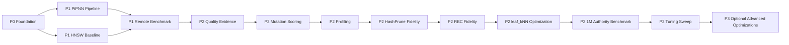

## 12. 初始化输入摘要（给 long-task-init）

- language: `cpp`
- 核心质量门槛: recall@10 >= 0.95（100k/100, 200k/100, 500k/100）
- 约束: 必须包含 hnswlib 标准基线；远端 x86 可复现
- 优先路线: `fanout=1 + replicas=2 + max_leaders=128 + beam=256` 作为当前默认候选
