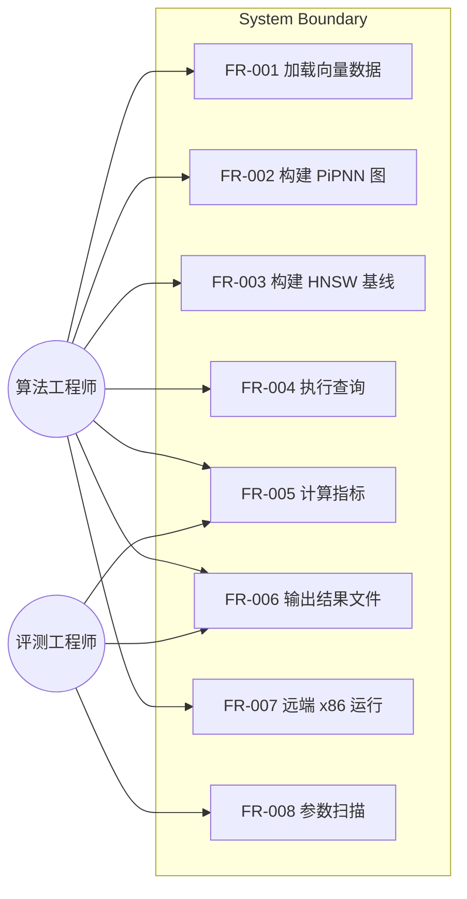
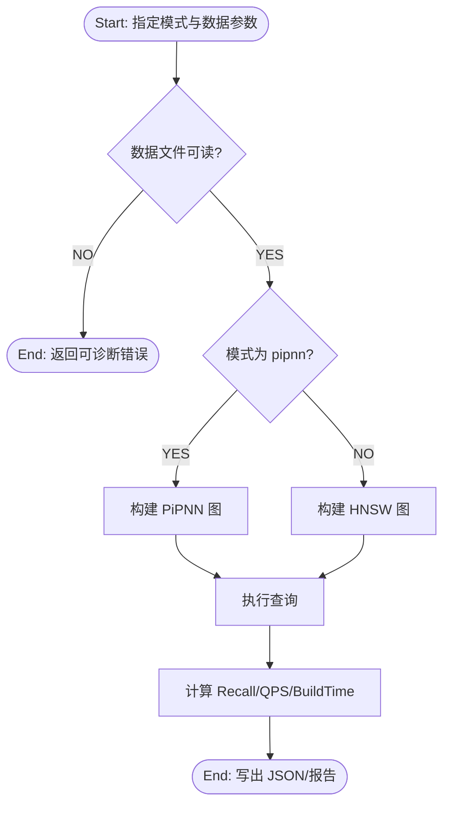

# PiPNN PoC 软件需求规格说明书（SRS）

<!-- SRS Review: PASS after 1 cycle — 2026-03-12 -->

- Date: 2026-03-12
- Status: Approved
- Standard: ISO/IEC/IEEE 29148

## 1. 目的与范围

### 1.1 目的
本项目用于验证 PiPNN 论文核心算法在工程实现中的可行性与性能趋势，重点对比标准 `hnswlib` 基线。

### 1.2 范围
本版本范围包含：
- C++ 单机 PoC 实现（PiPNN + HNSW 基线）
- SIFT 数据加载、建图、查询、评测、结果产出
- 远端 x86 编译评测工作流
- 分阶段算法迭代工作流（paper fidelity -> authority benchmark）

### 1.3 明确不在范围（Exclusions）
- EXC-001: 不包含分布式训练/建图。
- EXC-002: 不包含 GPU/TPU 加速实现。
- EXC-003: 不承诺生产级 API 稳定性与兼容策略。

## 2. 术语与参与者

### 2.1 术语
- ANN: Approximate Nearest Neighbor
- RBC: Randomized Ball Carving
- Recall@10: 查询前 10 结果与真值的重合比例

### 2.2 参与者
- Actor-001: 算法工程师（运行构建、调参、评测）
- Actor-002: 评测工程师（复现实验、生成报告）

## 3. 用例视图

### 3.1 Use Case Diagram

## 4. 功能需求（FR）

### 4.1 流程图

#### Flow: 单次评测流程

### 4.2 需求清单（EARS）

- FR-001（Event-driven）
  - 需求: 当用户提供 `--base` 与 `--query` 时，系统应加载对应向量数据；若提供 `--truth`，系统应加载真值。
  - Priority: Must
  - Acceptance Criteria: Given 有效 `fvecs/ivecs` 文件，When 执行命令，Then 成功进入建图阶段。

- FR-002（Event-driven）
  - 需求: 当 `--mode pipnn` 时，系统应按参数执行 PiPNN 建图流程（RBC -> leaf kNN -> HashPrune）。
  - Priority: Must
  - Acceptance Criteria: Given `--mode pipnn`，When 执行，Then 输出包含 `build_sec/recall_at_10/qps/edges`。

- FR-003（Event-driven）
  - 需求: 当 `--mode hnsw` 时，系统应使用标准 `hnswlib` 执行建图与查询。
  - Priority: Must
  - Acceptance Criteria: Given `--mode hnsw`，When 执行，Then 输出同构指标 JSON。

- FR-004（Ubiquitous）
  - 需求: 系统应支持 `--max-base` 与 `--max-query` 以运行子集评测。
  - Priority: Must
  - Acceptance Criteria: Given `--max-base 30000`，When 执行，Then 实际样本数不超过 30000。

- FR-005（Ubiquitous）
  - 需求: 系统应计算并输出 `build_sec`、`recall_at_10`、`qps`、`edges`。
  - Priority: Must
  - Acceptance Criteria: Given 任一模式，When 成功执行，Then JSON 包含上述字段且可解析。

- FR-006（Unwanted behavior）
  - 需求: 若输入文件不存在或格式错误，系统应返回非零退出码并输出可诊断错误信息。
  - Priority: Must
  - Acceptance Criteria: Given 错误路径，When 执行，Then 返回失败并提示 `cannot open` 或维度错误。

- FR-007（Optional）
  - 需求: 当设置 `PIPNN_PROFILE=1` 时，系统应输出建图阶段耗时拆分（partition/leaf_knn/prune）。
  - Priority: Should
  - Acceptance Criteria: Given 环境变量开启，When 执行，Then stdout 含 `pipnn_profile_build` 行。

- FR-008（Optional）
  - 需求: 当设置 `PIPNN_ECHO_CONFIG=1` 时，系统应回显关键超参数。
  - Priority: Could
  - Acceptance Criteria: Given 环境变量开启，When 执行，Then stdout 含参数回显。

- FR-009（Event-driven）
  - 需求: 当调用远端脚本时，系统应支持在 x86 主机执行构建、测试和评测。
  - Priority: Must
  - Acceptance Criteria: Given 合法远端配置，When 运行 remote 脚本，Then 成功产出远端日志与结果文件。

- FR-010（Optional）
  - 需求: 系统应支持网格调参脚本输出汇总表（TSV/JSON）。
  - Priority: Should
  - Acceptance Criteria: Given 调参脚本执行完成，When 检查输出目录，Then 存在汇总文件与每组 JSON。

## 5. 非功能需求（NFR）

- NFR-001 性能（Must）
  - 需求: 系统应支持并固定评测口径 `100k/100`、`200k/100`、`500k/100` 三档，并在每档输出 PiPNN 与 HNSW 的 `build_sec` 对比。
  - 验证: 三档口径均产出双方法 JSON 结果文件。
  <!-- Wave 4: Modified 2026-03-12 — add algorithm-iteration benchmark slices -->
  - 注记: wave 4 算法迭代额外使用 `100k/200` 作为快速迭代口径，使用 `1M/100` 作为 authority benchmark 口径。

- NFR-002 质量（Must）
  - 需求: 在 `100k/100`、`200k/100`、`500k/100`（子集内真值口径）下，优化配置应满足 `recall_at_10 >= 0.95`。
  - 验证: 读取输出 JSON 的 `recall_at_10`。

- NFR-003 可复现（Must）
  - 需求: 远端实验必须记录命令与日志路径，并可回传到本地目录。
  - 验证: 检查 `remote-logs/` 与结果文档是否包含命令与数据路径。

- NFR-004 可靠性（Should）
  - 需求: 所有本地单元测试应保持 100% 通过。
  - 验证: `ctest --test-dir build --output-on-failure`。

<!-- Wave 2: Added 2026-03-12 — quality methodology and mutation environment follow-up -->
- NFR-005 覆盖率度量（Must）
  - 需求: 对外审计使用的覆盖率结果应以远端 x86 GCC 的 clean `build-cov` 结果为准；统计范围仅包含项目自有源文件，排除第三方 `_deps`、编译器识别目录以及编译器生成的 throw/unreachable branch。
  - 验证: 在远端 x86 主机执行文档化 coverage 命令，生成 `results/st/line_coverage.txt` 与 `results/st/branch_coverage.txt`，并满足 `line >= 90%`、`branch >= 80%`。

<!-- Wave 3: Modified 2026-03-12 — remote scored-state mutation workflow -->
- NFR-006 Mutation 证据（Must）
  - 需求: 系统应优先在远端 x86 主机上使用用户态 `LLVM + Mull` 工具链执行 mutation campaign，并对批准的 `src/` 增量集满足 `mutation_score >= 80%`；仅当 scored-state pipeline 尚未引入到目标环境时，才允许记录 blocked-state evidence，并在测试报告中给出处置结论与后续动作。
  - 验证: 运行文档化远端 mutation 命令或 probe/command，检查日志、报告、聚合分数、以及 `Go/Conditional-Go/No-Go` 结论。

<!-- Wave 4: Added 2026-03-12 — algorithm iteration -->
- NFR-007 Paper Fidelity 迭代（Must）
  - 需求: 系统应支持按 `HashPrune -> RBC -> leaf_kNN` 的顺序执行分阶段算法迭代；每个完成的阶段都必须在 `100k/200` 口径上恢复到 `Recall@10 >= 0.95`。
  - 验证: 对每个阶段读取结果 JSON 与阶段统计输出，确认 recall 门槛恢复且诊断指标存在。

- NFR-008 Authority Benchmark（Must）
  - 需求: 系统应支持先冻结当前 PoC 的 `1M/100` baseline，再用 wave 4 候选与其比较；最终候选必须保证 recall 不低于 baseline，且 build time 低于 baseline。
  - 验证: 比较 `1M/100` baseline 与 wave 4 authority benchmark 的 JSON/日志结果。

## 6. 约束、假设、接口

### 6.1 约束（CON）
- CON-001: 实现语言为 C++，构建系统为 CMake。
- CON-002: 基线必须使用标准 `hnswlib`。
- CON-003: 编译与评测优先在远端 x86 Linux 主机执行。
- CON-004: mutation score 权威口径使用远端 x86 用户态 `LLVM + Mull` 与独立 `build-mull` 构建目录。
- CON-005: wave 4 必须在保持当前 PoC 路径可运行的前提下推进，禁止语义改动与重优化在同一阶段混合提交。

### 6.2 假设（ASM）
- ASM-001: 远端主机可访问 SIFT 数据文件。
- ASM-002: 远端主机具备 GCC/CMake/OpenMP 基础工具链。
- ASM-003: 远端主机可下载或已缓存匹配版本的 `LLVM` 与 `Mull` 发布包。
- ASM-004: 当前 PoC 可在远端 x86 上重复运行 `1M/100`，用于冻结 authority baseline。

### 6.3 接口（IFR）
- IFR-001: CLI 接口通过 `./build/pipnn` 提供。
- IFR-002: 远端执行通过 `generic-x86-remote` 脚本族提供。

## 7. 追踪矩阵（简版）

- 目标 A（HashPrune 可行性） -> FR-002, FR-006, FR-007
- 目标 B（端到端流程） -> FR-001..FR-005
- 目标 C（性能对比） -> FR-003, FR-005, NFR-001, NFR-002

## 8. 已确认项

- CQ-001: 评测口径固定为 `100k/100`、`200k/100`、`500k/100`。
- CQ-002: 质量阈值固定为 `recall_at_10 >= 0.95`。
- CQ-003: 覆盖率权威口径固定为远端 x86 GCC clean `build-cov`，且 branch 排除 throw/unreachable 编译器分支。
- CQ-004: mutation 证据允许两种终态：远端 scored-state `score >= 80%`（优先），或 legacy `blocked-state evidence + 明确处置结论`。
- CQ-005: wave 4 的优先级固定为 `HashPrune fidelity -> RBC fidelity -> leaf_kNN optimization -> 1M/100 authority benchmark`。
- CQ-006: wave 4 采用 `100k/200` 快速迭代、`1M/100` authority benchmark、以及 `hybrid` 门槛策略（阶段完成后 `Recall@10 >= 0.95`）。
